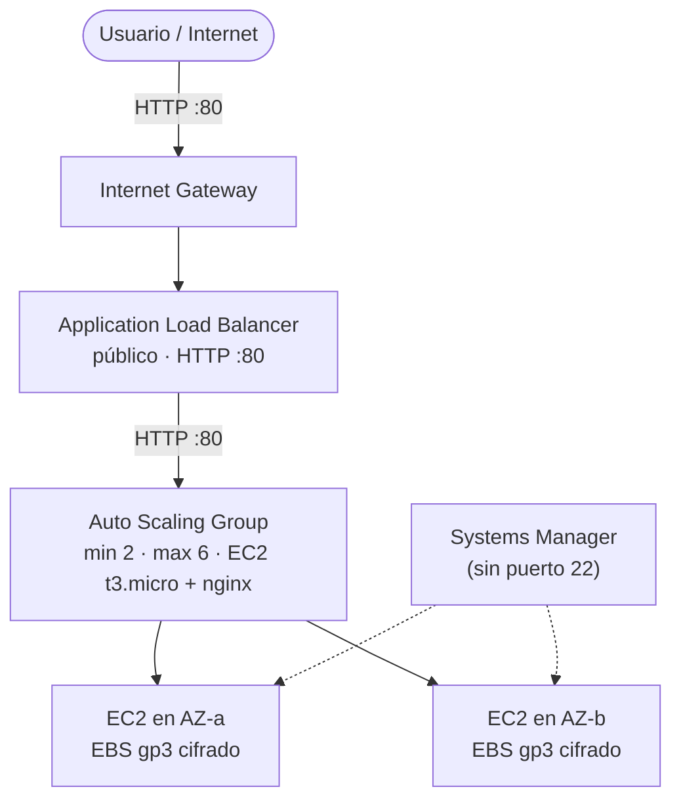

# Arquitectura — Aplicación Web de Alta Demanda

> Infraestructura definida con **AWS CDK v2 (TypeScript)** en [`cdk/lib/web-app-stack.ts`](../cdk/lib/web-app-stack.ts).

---

## 1. Diagrama de arquitectura



**Resumen:** `Usuario → Internet Gateway → ALB (subnet pública) → EC2 + Nginx (Auto Scaling Group)`.
Las instancias viven en **subnets públicas**, pero **no son accesibles desde internet**: su Security Group solo admite tráfico del ALB.

---

## 2. Stack tecnológico

| Componente     | Tecnología                  | Configuración                                |
| -------------- | --------------------------- | -------------------------------------------- |
| IaC            | **AWS CDK v2** + TypeScript | Stack `WebAppStack`                          |
| Red            | **VPC**                     | 2 AZs · 2 subnets públicas · sin NAT Gateway |
| Entrada        | **Internet Gateway + ALB**  | Listener `:80`                               |
| Cómputo        | **Amazon EC2**              | `t3.micro` · Amazon Linux 2023 · Nginx       |
| Escalado       | **Auto Scaling Group**      | min 2 · max 6 · escala con CPU > 60 %        |
| Almacenamiento | **Amazon EBS**              | `gp3` 20 GiB cifrado                         |
| Seguridad      | **IAM + Security Groups**   | Rol de mínimo privilegio · sin SSH           |
| Monitoreo      | **CloudWatch**              | Alarma de CPU > 60 %                         |
| Administración | **Systems Manager**         | Session Manager                              |

---

## 3. Por qué cada componente

| Componente             | Decisión                                                                         | Motivo                                                                                                                              |
| ---------------------- | -------------------------------------------------------------------------------- | ----------------------------------------------------------------------------------------------------------------------------------- |
| **VPC / Subredes**     | 2 AZs, subnets públicas, `natGateways: 0`                                        | Una AZ puede caerse sin dejar el sitio sin servicio. Sin NAT Gateway se ahorra el costo mensual.                                    |
| **Security Groups**    | 2 SGs encadenados: `0.0.0.0/0:80` al ALB y `tcp:80` **solo desde el SG del ALB** | Solo el ALB queda expuesto; las EC2 no aceptan tráfico directo. Referenciar el SG en vez de un CIDR evita errores de configuración. |
| **IAM / SSM**          | Rol con una sola policy (`AmazonSSMManagedInstanceCore`) y **puerto 22 cerrado** | Mínimo privilegio y acceso remoto por Session Manager (HTTPS), sin SSH ni Key Pairs que exponer.                                    |
| **Auto Scaling Group** | min 2 · max 6 · target tracking CPU > 60 % · cooldown 60 s                       | Mantiene 2 instancias siempre activas y agrega capacidad sola cuando llega el pico de tráfico.                                      |
| **ALB**                | Health check `/` cada 10 s · `deregistrationDelay: 15 s`                         | Detecta instancias caídas rápido y drena el tráfico en 15 s para que el usuario no vea errores al escalar.                          |
| **EBS**                | `gp3` 20 GiB cifrado                                                             | Disco SSD cifrado, barato y suficiente para la app.                                                                                 |

---

## 4. Preguntas

**¿Cómo se absorbe un pico de tráfico 10x?**
De forma automática: al subir la CPU por encima del 60 %, el ASG lanza instancias nuevas hasta el máximo permitido. El ALB las detecta en ~20 s y reparte el tráfico entre ellas. Cuando baja la demanda, las instancias sobrantes se terminan y se drenan en 15 s.

**¿Qué pasa si falla una instancia EC2?**
El health check del ALB la marca como no sana en ~20 s, deja de enviarle tráfico y el ASG lanza otra para mantener las 2 instancias. El usuario no percibe caída.

**¿Por qué no se abrió el puerto 22?**
Para no exponer un puerto de administración a internet. El acceso se hace con **Session Manager**, que viaja por HTTPS, no deja sesiones de SSH abiertas y queda auditado en CloudTrail.

**¿Qué pasa si falla una AZ completa?**
El ALB tiene nodo en las 2 AZs, así que sigue atendiendo con la AZ sana. El ASG redistribuye las instancias hacia esa AZ.

---

## 5. Comandos útiles

Todos se ejecutan dentro de `cdk/`:

```bash
npm install                # Instalar dependencias
npm run build              # Validar tipos (tsc)
npm run synth              # Generar la plantilla CloudFormation
npm run diff               # Ver qué cambiaría en la cuenta (antes de desplegar)
npm run deploy             # Desplegar la infraestructura
npm test                   # Ejecutar pruebas

# Ver la URL del ALB
aws cloudformation describe-stacks --stack-name WebAppStack \
  --query "Stacks[0].Outputs[?OutputKey=='LoadBalancerDNS'].OutputValue" --output text

# Probar la aplicación
curl -I http://<ALB-DNS>                 # Esperar respuesta 200
curl -s http://<ALB-DNS> | grep Instancia   # Ver qué instancia responde

# Entrar a una instancia sin SSH
aws ssm start-session --target <instance-id>

# Limpiar todo
npx cdk destroy
```

---

## 6. Conclusión

- **Alta disponibilidad:** 2 AZs y mínimo 2 instancias: una AZ o una instancia pueden caerse sin detener el servicio.
- **Seguridad:** un solo punto de exposición (el ALB en `:80`), sin SSH y con permisos mínimos.
- **Escalabilidad:** el ASG agrega y quita instancias solo, según el uso de CPU.
- **Costos:** instancias pequeñas, sin NAT Gateway y con un stack que se destruye con un comando.

---

_Challenge 2 — Aplicación Web de Alta Demanda · AWS Cloud Practitioner Challenge · AWS SBG Univalle_
