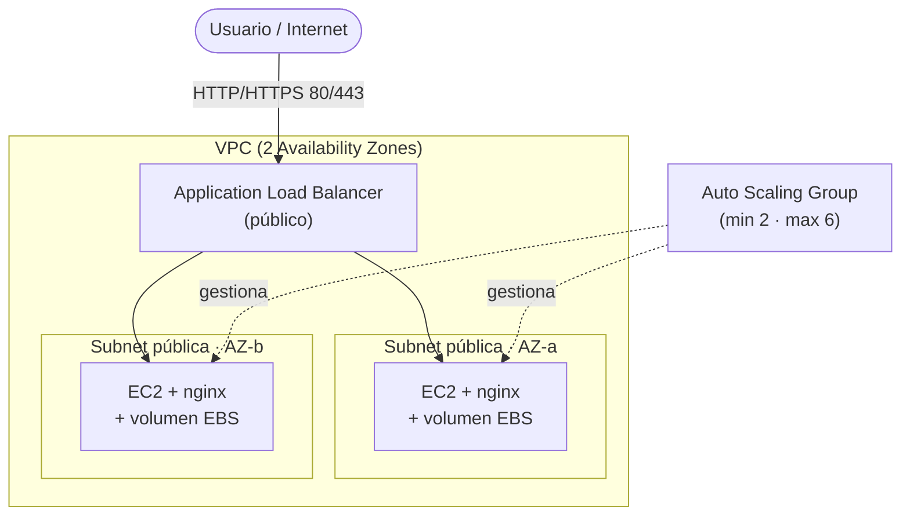

# Arquitectura — Aplicación Web de Alta Demanda

> Plantilla para que documentes **tu** diseño. Complétala a medida que construyes tu stack de CDK.

---

## 1. Diagrama de arquitectura

_Este es un diagrama de referencia. Reemplázalo por el tuyo a medida que diseñas tu stack._

---

## 2. Componentes

| Componente | Servicio AWS | Responsabilidad | Decisiones de diseño |
|---|---|---|---|
| Red | VPC | _¿Cuántas AZs? ¿Subnets públicas/privadas?_ | |
| Cómputo | EC2 | _¿Tipo de instancia? ¿AMI? ¿user-data?_ | |
| Escalado | Auto Scaling Group | _min/max, ¿health check por ELB?_ | |
| Balanceo | ALB | _¿Listener? ¿Target group? ¿Health check?_ | |
| Almacenamiento | EBS | _¿Tamaño? ¿removalPolicy?_ | |
| Permisos | IAM | _¿Qué necesita el rol de la instancia?_ | |
| Seguridad | Security Groups | _¿Quién habla con quién?_ | |

---

## 3. Seguridad y acceso

- ¿Cómo garantizas que **solo el ALB** reciba tráfico de internet en 80/443?
- ¿Cómo permites que las EC2 reciban tráfico **solo desde el ALB** (SG referenciando SG)?
- ¿Qué permisos mínimos otorgaste al rol IAM de las instancias?

_Completa aquí tu razonamiento._

---

## 4. Alta disponibilidad y tolerancia a fallos

- ¿Cómo sobrevive la caída de una AZ?
- ¿Qué pasa cuando terminas una instancia manualmente? ¿Quién la reemplaza?
- ¿Cómo detecta el ALB que una instancia está sana? (health check path)

---

## 5. Flujo de despliegue

- Lenguaje elegido para CDK: `______`
- Comando(s) para desplegar: `cdk deploy`
- Comando(s) para destruir: `cdk destroy`

---

## 6. Boss Fight (si lo abordaste)

- ¿Qué **política de escalado** configuraste? (target tracking por CPU > 60%)
- ¿Cómo verificaste que el ASG **escala solo** sin intervención manual?
- (Opcional) ¿Qué **CloudWatch Alarms** añadiste?
- ¿Cómo confirmaste que el **ALB no es el cuello de botella**?

_Completa aquí tu solución._
